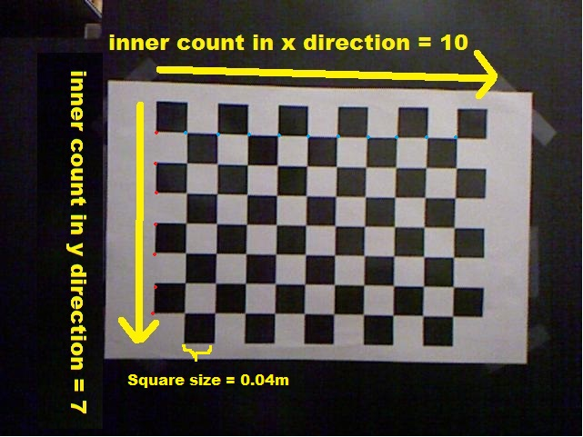
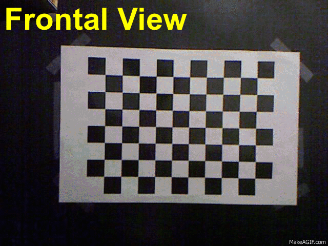
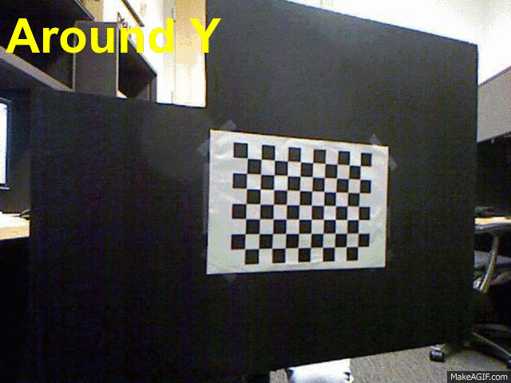
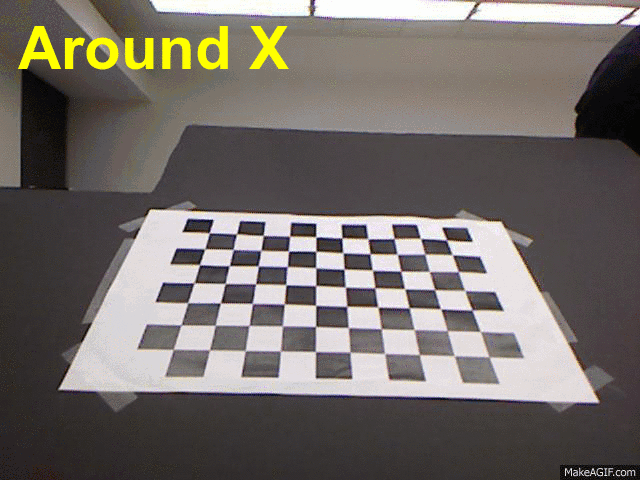
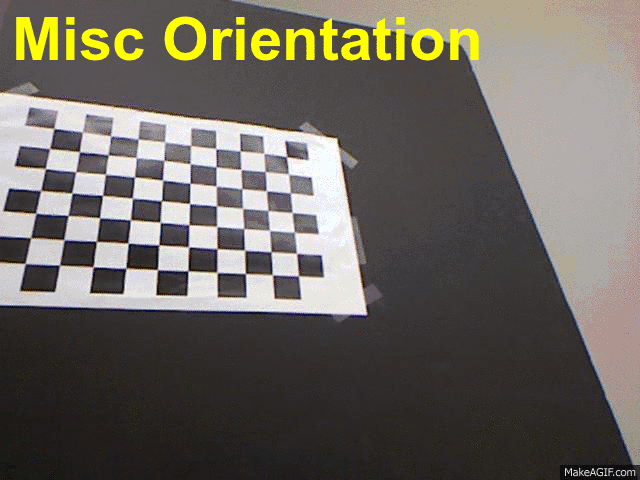
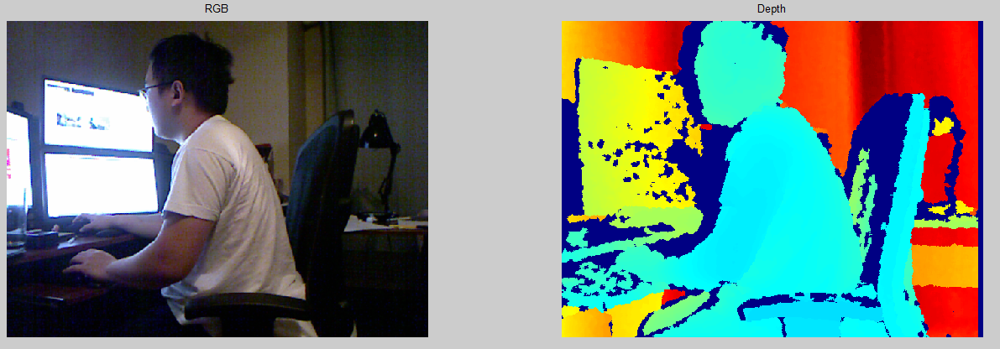
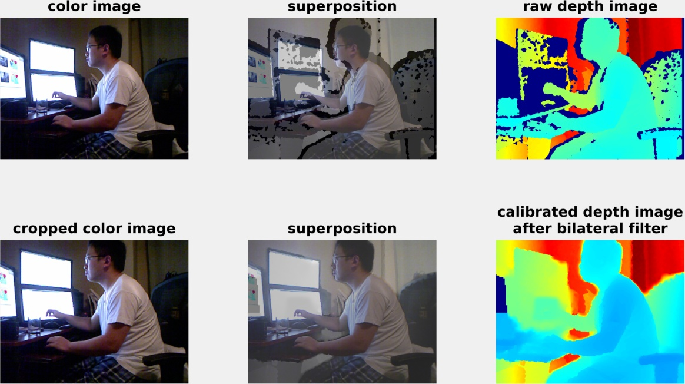

# Joint-Calibration-Toolbox-for-Kinect

<!-- START doctoc generated TOC please keep comment here to allow auto update -->
<!-- DON'T EDIT THIS SECTION, INSTEAD RE-RUN doctoc TO UPDATE -->
**Table of Contents**
=================
- [Code](#code)
- [Usage](#usage)
- [Demo](#demo)
  - [Offline calibration](#offline-calibration)
  - [Online calibration](#online-calibration)
  - [Offline vs. Online](#offline-vs-online)
  - [Illustration](#illustration)
  - [View depth data](#view-depth-data)
- [Capture](#capture)
- [Record](#record)
- [Configuration](#configuration)
- [Environment](#environment)
- [Compile libfreenect yourself](#compile-libfreenect-yourself)
- [After Calibration](#after-calibration)
- [Visualization](#visualization)
- [Reprojection](#reprojection)
- [Dispatiry file content](#dispatiry-file-content)
- [Conversion between disparity and depth](#conversion-between-disparity-and-depth)
- [Reference](#reference)
- [Update](#update)

<!-- END doctoc generated TOC please keep comment here to allow auto update -->


<section>

## Code

This toolbox contains some useful code in calibrating Kinect, which also replicates my review work in Kinect calibration.

For anyone intersted in this work, you can find details from my review paper ["A review and quantitative comparison of methods for kinect calibration"](http://vlm1.uta.edu/~athitsos/publications/xiang_iwoar2015.pdf) as well as the corresponding [technical report](assets/joint_calibration.pdf).

</section>

<section>

## Usage

You will get three of the following directories:

1.  **capture**--including libfreenect library and its Matlab wrapper.
2.  **record**--a tool that helps to record data stream from Kinect in Matlab.
3.  **demo**--including the core of calibration and sample dataset.

### Demo

Run [main.m](demo/toolbox/main.m) to start, program is quite easy to understand as long as you follow the command prompts.
There are two ways for you to calibrate your kinect:

1.  **offline**--calibrate using your pre-obtained data.
2.  **online**--calibrate using data captured in real-time.

#### Offline calibration

I am providing dataset _'../smallset/'_ for reference (however, you must capture data with your own Kinect) which examfies file format of our offline calibration: (instructions cited from document attached with the original code)

1.  Put all files in the same directory, whose path needs to be specified in the command prompt.
2.  For a successful calibration 4 types of images must be present: frontal plane, plane rotated around the X axis, plane rotated around the Y axis, and full image planar surface for distortion correction.
3.  If you want to calibrate the disparity distortion model, you should also take some images of a bigger plane (e.g. a wall) that fills the entire image.
4.  For a proper calibration, the algorithm requires around 30 images from different angles.
5.  All images taken by Kinect color camera is formatted as "0000-c1.jpg".
6.  All images taken by Kinect depth camera is formatted as "0000-d.pgm".
7.  Images corresponding to the same plane pose should have the same prefix number.
8.  A given plane pose may have only one color image, only the depth image, or any combination.
9.  The calibration uses the information from those images that are present.

It should be noted that during offline calibration, intermediate data will be saved in directory where all images exist, in case that any accident happens. If you want to redo any intermediate step, just delete corresponding _.mat_ file and its previous .mat file, then algorithm should go through correctly.

Note on the sequence of intermediate data storage:
dataset.mat->rgb_corners.mat->depth_plane_mask.mat->calib0.mat->final_calib.mat


#### Online calibration

There are several important default parameters that should be clarified in online calibration:

*   sqr_def: square size for checkerboard (m).
*   win_def: window size of automatic corner finder (pixel).
*   cnt_x_def: inner corner count of checkerboard in X direction.
*   cnt_y_def: inner corner count of checkerboard in Y direction.
*   pic_num: number of images that must be taken for each of the three views including frontal, around x and around y, at various distances.
*   wall_num: number of images that must be taken in front of a wall, at various distances.

Decrease _pic_num_ and _wall_num_ for your ease of use, however, as for a proper calibration, 30 images are needed while 50 images (approximately) will help achieve a satisfactory result. That is to say, 8 images for every pose plus 5 of wall images (default) meet the basic requrement, while 10 for every pose plus 8 wall images are definitely better (approximately).

Also, please see the following illustration on how to count inner corner count of the checkerboard:


<a href="url"></a>

Be aware that during online calibration, all intermediate data including images captured, rgb corners detected and depth corners selected, etc., will be deleted for concerns of conflicting data. This may not be a good design, therefore, I will add functions to save intermediate data in the future.


#### Offline vs. Online

In the original code, the author only provided offline calibration, which makes corner detection a headache problem due to low-quality captured images and far placement of checkerboard. Offline calibration of this demo remains the same with original one, i.e., for each of the images in specified directory, the corner finder will try to detect (_cnt_x_def_+1) × (_cnt_y_def_+1) number of squares with side size _sqr_def_ (by default).

If the detection failed, however, you will be asked to manually label the four corners of checkerboard. But remember, most likely the corner finder will still not detect all the points successfully, given the image quality is low and/or checkerboard is placed far away (more than 5m, empirically) from the camera. To avoid this, I suggest:

*   Using online calibration when possible.
*   If corner detection failed in offline calibration, delete that specific picture (and corresponding depth) and re-take one with the same position, adjust illumination condition and/or distance. Do not forget to name the images retaken (both rgb and depth) with same index in prescribed format.
*   If corner detection failed in online calibration, simply adjust illumination condition and/or distance and restart following the prompt.
*   For your ease of use, try to make the distances smaller than 5m.


#### Illustration

To have a better understanding of how you should capture your data, please do it according to the following illustration:






<a href="url"></a>


#### View depth data

If you have difficulty in viewing pgm file with Windows built-in Windows Photo Viewer, please download [Xnview](http://www.xnview.com/en/).


### Capture

Run _mex_test_ (make sure your kinect is well connected) to see whether you can use libfreenect smoothly, you will see a window pop-up like this

<a href="url"></a>

This program will exit once you **click 'x'** on the figure.


### Record

Run _record_ (make sure your kinect is well connected) to start, the program will begin recording data stream in _'../output/pic/'_. Once you are turning on _make_avi_ flag in _record.m_, the stream will be recorded as video with specified frame rate, in directory _'../output/video/'_. Besides, you can also adjust starting index of data set with variable _set_ind_, and one for file name with variable _cnt_. The format of file name is for eg. "set0_0000.jpg" and "set0_0000.pgm", which stores rgb and raw depth (also called disparity) respectively.

Note that the [main.m](demo/toolbox/main.m) is able to capture data by its own and therefore does **not** rely on this tool.

This program will exit once you **right-click** on the figure.</section>


<section>

## Configuration

Be aware that in order to capture Kinect data stream instantly from Matlab, you must have the prescribed configuration on your system.

### Environment

The code is dependent on 3rd-lib **libfreenect** to connect Kinect, I have compiled its Matlab wrapper (named _kinect_mex.mex_) for your convinient use in Matlab. Currently, it supports all three popular platforms of Matlab with 64-bit environment:

|        | Windows 7 | Windows 8.1 | Linux (Ubuntu 14.04) | MAC OS X |
|--------|-----------|-------------|----------------------|----------|
| 32-bit |    N/A    |     N/A     |          N/A         |    N/A   |
| 32-bit |    Yes    |     Yes     |          Yes         |    Yes   |


### Compile libfreenect yourself

You may find that you are not able to run _kinect.mex_ when capturing data, which means, you have to compile libfreenect yourself.

However, if you are using Matlab/Windows of 32-bit, you may have painful experience in resolving dependencies to compile libfreenect on your own system.
For your reference, I am attaching the environment and all dependencies used when I was compiling libfreenect:

*   Platforms: Windows 7 (64-bit) + Matlab (64-bit) + Visual Studio 2010 (32-bit--only) + Windows SDK 7.1
*   Libraries: libfreenect-0.1.2 + glut-3.7.6-bin + libusb-1.0.19 + libusb-win32-bin-1.2.4.0 + pthreads-w32-2-8-0-release + unistd

Unfortunately the newest version (v0.5.0--Saturn) of libfreenect that I compiled can **not** run successfully and after digging for quite a while, I found libfreenect-**0.1.2** is most suitable for the wrapper we use. As you may notice, there are two versions of libusb linked, the reason is that libfreenect-0.1.2 call interfaces from both versions.

In addition, always make sure that you are using the same environment of the following:

1.  Mex compiler embedded in Matlab
2.  C compiler (usually located in Visual Stuio IDE), using _mex -setup_ to find C compiler for Matlab
3.  All other 3-rd part dependencies

to compile for mex in Matlab. For e.g., if you are running 32-bit Matlab, you can use default C compiler located in Visual Studio. However, for 64-bit Matlab, please download WinSDK 7.1 in order to let Matlab utilize 64-bit C compiler and meanwhile, re-compile all other 3-rd dependencies using 64-bit compiler and link all together for _kinect.mex_. You may encounter "undefined external symbols" when you are trying to compile for mex files, if any of your dependencies' bit environment is different from your compiler's, or the two compilers' differ from each other.

See [compile_mex.m](capture/compile_mex.m) in _capture_ directory for details.</section>


<section>

## After Calibration

### Visualization

In _demo/toolbox_ directory, find file [show_calib_result.m](demo/toolbox/show_calib_result.m), with which you can utilize to visually evaluate your calibration result, as shown below:



Note that in [show_calib_result.m](demo/toolbox/show_calib_result.m), change _calib_filepath_ to the path where _final_calib.mat_ locates, you can either test on single image file (file that must be taken by this specific Kinect you have calibrated), or on the data stream, simply by swtiching the variable _testing_realdata_. Besides, turn off _add_noncalib_comparison_ to skip comparison with non-calibrated result.

Also, be aware that the program utilized a multi-scale bilateral filter to fill the _'holes'_ from depth image, which resulted from surfaces of high/low reflectivity. Code of filter can be downloaded from [NYU Kinect toolbox V2](http://cs.nyu.edu/~silberman/datasets/nyu_depth_v2.html).

This program will exit once you **click 'x'** on the figure.


### Reprojection

For anyone who wants to use calibration result to reproject depth points from depth space to rgb space, please make use of the function [compute_rgb_depthmap](demo/toolbox/compute_rgb_depthmap.m). Also, refer to [show_calib_result.m](demo/toolbox/show_calib_result.m) on how to use this function correctly.</section>


### Dispatiry file content

The raw data obtained from libfreenect using Kinect depth sensor is actually a 11-bit number between 0-2047, called **disparity** (with unit in **kdu**--kinect disparity unit), while other libraries like OpenNI provides converted depth data. One of the easiest convertion is (used in the demo code):


where, _d_ is disparity and _z_<sub>d</sub> is converted depth. \[_c_<sub>0</sub>, _c_<sub>1</sub>\] are part of the depth camera intrinsic parameters to be calibrated. If you want to convert data from disparity to depth with better approximation, take a look at this link: [http://openkinect.org/wiki/Imaging_Information](http://openkinect.org/wiki/Imaging_Information)

It is worth mentioning that if you use Matlab _imread_ to read a pgm file, it will automatically **rescale** data from \[0, 2047\] to \[0, 65535\] which leads to the failure of algorithm. Therefore, I am providing a function [_format_disparity_](demo/toolbox/format_disparity.m) that will recover data read from _imread_. The second argument indicates that whether you are using disparity read from Matlab _imread_ (true) or not (false).

The following are suggestions for anyone who wants to utilize demo code for their own purpose:

*   If you want to read disparity with the path of pgm file, use _read_disparity_ directly.
*   If you have disparity captured from libfreenect, do not do anything.
*   If you have disparity read by Matlab _imread_ from pgm file, use _format_disparity_.

In the code I uploaded, _format_disparity_ was called immediately after capturing data from libfreenect. There was no effect of that, except for telling you be aware of the pgm file content.

### Conversion between disparity and depth

For all the three kinect libraries: Windows Kinect SDK, Libfreenect and OpenNI/OpenNI2, you should be aware of the data format they use. As for libfreenect, it returns disparity while the others return depth in mm. However, if you want to calibrate with this toolbox, you must input disparity rather than depth. For depth data you have captured from Windows Kinect SDK and OpenNI/OpenNI2, the first thing you should do is to convert depth to disparity, which can be solved by using the inverse of above equation.

It is noted that after you applying inverse equation on depth, disparity values will lie on certain range. For e.g., if you convert with \[_c_<sub>0</sub>, _c_<sub>1</sub>\] = \[_3.3309495161_ _-0.0030711016_\]. Which is recommened by the book "Hacking the Kinect", the converted disparity will have a range of \[678.0987, 1002.6947\] (I am assuming the data is captured from WinSDK, which has a range limit of at least 0.8m). However, the raw disparity data returned by libfreenect lies in range like \[380, 1009\] (lower limit indicates that the libfreenect can captrure data as close as 0.4m), which is expected to be used by this toolbox.

Therefore, if you have converted disparity data, make sure you know which two of [_c_<sub>0</sub>, _c_<sub>1</sub>] you have used, or used by the people who send you data. Besides, to visualize the disparity data, you need to save them into a range of \[0, 65535\]. So, the correct sequence of conversion from depth to disparity must be (Supporse you use Windows Kinect SDK or OpenNI/OpenNI2):

*   Convert depth data from uint of millimeter to meter.
*   Convert depth in meter to disparity using inverse equation of the one shown above, where you need to know which \[_c_<sub>0</sub>, _c_<sub>1</sub>\] you use. I recommend to use \[_c_<sub>0</sub>, _c_<sub>1</sub>\] = \[_3.3309495161_ _-0.0030711016_\] (which shows better performance after experiments).
*   Test the range of disparity data you have obtained, say it is [_min_, _max_].
*   Scale disparity with standard range of \[0, 2047\], by using "<u>imd=(imd+1-min)/(max-min+1)</u>". (adding 1 in order to distinguish between outlier value 0 with minimal disparity value in image).
*   Scale disparity of \[0, 2047\] to \[0, 65535\] by using bit shifting operation (from bit 1:log(2048) to 1:log(65536)) and save it in pgm format.
*   Pgm files now can be visulized with tools like [Xnview](http://www.xnview.com/en/).

Here are some recommendations for reading pgm files:

*   If you are reading data captured from libfreenect, you don't have to do anything.
*   If you are reading data captured from Windows Kinect SDK and OpenNI/OpenNI2, read data and then firstly normalize disparity values into standard 11-bit range, i.e., [0, 2047]. After that, make sure you scale your data with obtained range [_min_, _max_] by using "<u>imd=imd*(max-min+1)+min-1</u>". Now you can convert from disparity to depth safely and get correct depth data.


<section>

## Reference

If you find this toolbox useful, plese cite our paper at:

```
@inproceedings{xiang2015review,
    title={A review and quantitative comparison of methods for kinect calibration}, 
    author={Xiang, Wei and Conly, Christopher and McMurrough, Christopher D and Athitsos, Vassilis}, 
    booktitle={Proceedings of the 2nd international Workshop on Sensor-based Activity Recognition and Interaction}, 
    pages={3}, 
    year={2015}, 
    organization={ACM} 
}
```

This work originates from the University of Oulu, by:
Herrera C., D., Kannala J., Heikkila, J., "Joint depth and color camera calibration with distortion correction", _TPAMI_, 2012.
Please see link of the original code: [http://www.ee.oulu.fi/~dherrera/kinect/](http://www.ee.oulu.fi/~dherrera/kinect/), as well as corresponding [document](assets/doc_2_1.pdf) .

The libfreenect Matlab wrapper is provided by [Alexander Berg](http://acberg.com/kinect/).

For details on how to use Kinect, please take a look at: Kramer, Jeff, Nicolas Burrus, and Florian Echtler. **Hacking the Kinect**. New York, NY, USA:: Apress, 2012.

</section>


<section>

## Update

Curret up-to-date version is **v02_11_2015** (named by the last date I modified the files).

Questions, comments and bugs, please email to: wei.xiang@mavs.uta.edu

</section>
